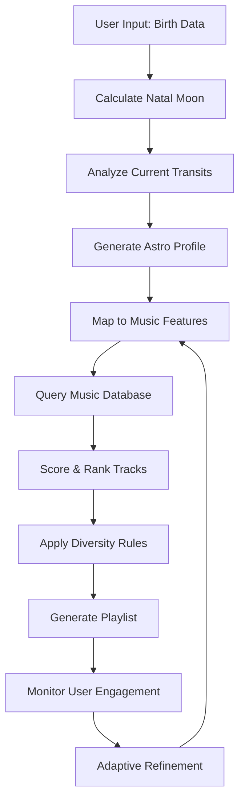

# Astrological Moon Sign Playlist Generation Algorithm

## Overview
This document outlines a robust algorithmic process for creating personalized playlists based on an individual's natal moon sign and current lunar transits. The system combines astrological data analysis with music metadata to generate contextually relevant playlists.

## Core Components

### 1. Astrological Data Collection Module

#### 1.1 Natal Moon Sign Determination
```python
def get_natal_moon_sign(birth_date, birth_time, birth_location):
    """
    Inputs:
    - birth_date: YYYY-MM-DD format
    - birth_time: HH:MM format (24-hour)
    - birth_location: (latitude, longitude) or city name
    
    Process:
    1. Use ephemeris data or API (e.g., AstroDienst, Astro.com API)
    2. Calculate exact moon position at birth moment
    3. Determine zodiac sign (0-30° segments)
    
    Returns:
    - moon_sign: string (e.g., "Aries", "Cancer")
    - moon_degree: float (0.0-29.99)
    - moon_house: int (1-12)
    """
```

#### 1.2 Current Transit Analysis
```python
def get_current_transits(natal_moon_position, current_datetime):
    """
    Calculate current planetary aspects to natal moon
    
    Key Transits to Track:
    - Conjunctions (0°)
    - Oppositions (180°)
    - Squares (90°)
    - Trines (120°)
    - Sextiles (60°)
    
    Returns:
    - active_transits: list of (planet, aspect, orb, intensity)
    """
```

### 2. Astrological Interpretation Engine

#### 2.1 Moon Sign Characteristics Database
```json
{
  "Aries": {
    "keywords": ["energetic", "impulsive", "pioneering", "direct"],
    "emotional_tone": "fiery, passionate, quick-changing",
    "musical_preferences": {
      "tempo": "fast to moderate",
      "energy": "high",
      "genres": ["rock", "electronic", "upbeat pop"],
      "instruments": ["drums", "electric guitar", "brass"]
    }
  },
  "Taurus": {
    "keywords": ["stable", "sensual", "grounded", "comfort-seeking"],
    "emotional_tone": "calm, steady, earthy",
    "musical_preferences": {
      "tempo": "slow to moderate",
      "energy": "mellow",
      "genres": ["R&B", "soul", "acoustic", "classical"],
      "instruments": ["strings", "piano", "acoustic guitar"]
    }
  },
  // ... continue for all 12 signs
}
```

#### 2.2 Transit Influence Modifiers
```python
def calculate_transit_influence(transit_data):
    """
    Modifies base moon sign characteristics based on current transits
    
    Examples:
    - Saturn conjunct Moon: Add melancholic, contemplative elements
    - Jupiter trine Moon: Amplify optimistic, expansive qualities
    - Mars square Moon: Increase tension, add aggressive elements
    """
```

### 3. Music Metadata Analysis System

#### 3.1 Song Feature Extraction
```python
def analyze_song_features(track_id):
    """
    Using Spotify API, Last.fm, or MusicBrainz:
    
    Extract:
    - Energy level (0-1)
    - Valence (emotional positivity)
    - Tempo (BPM)
    - Danceability
    - Acousticness
    - Instrumentalness
    - Key and mode
    - Loudness
    - Genre tags
    - Lyrical themes (via NLP analysis)
    """
```

#### 3.2 Astrological-Musical Mapping
```python
def map_astro_to_music_features(moon_data, transit_data):
    """
    Creates target music profile based on astrological factors
    
    Returns:
    {
        "target_energy": float,
        "target_valence": float,
        "tempo_range": (min_bpm, max_bpm),
        "preferred_genres": list,
        "avoid_genres": list,
        "instrumental_preference": float,
        "complexity_level": float
    }
    """
```

### 4. Playlist Generation Algorithm

#### 4.1 Core Selection Process
```python
def generate_playlist(user_astro_profile, available_tracks, playlist_length=30):
    """
    1. Create target music profile from astrological data
    2. Score all available tracks against profile
    3. Apply diversity constraints
    4. Order tracks for optimal flow
    
    Scoring Formula:
    score = (
        0.3 * energy_match +
        0.2 * valence_match +
        0.2 * genre_match +
        0.15 * tempo_match +
        0.15 * novelty_factor
    )
    """
```

#### 4.2 Dynamic Adaptation
```python
def adapt_playlist_realtime(current_playlist, user_feedback, moon_phase):
    """
    Adjusts playlist based on:
    - User skip behavior
    - Explicit ratings
    - Current moon phase (waxing/waning affects energy)
    - Time of day (moon's daily motion)
    """
```

### 5. Data Sources and Web Scraping

#### 5.1 Astrological Data Sources
- **APIs**: AstroDienst Swiss Ephemeris, Astro-Seek API
- **Web Scraping Targets**:
  - Astro.com for ephemeris data
  - TimeAndDate.com for moon phase information
  - Astrological interpretation sites for keywords

#### 5.2 Music Data Sources
- **Primary APIs**: Spotify Web API, Last.fm API
- **Supplementary Sources**:
  - MusicBrainz for detailed metadata
  - Genius API for lyrical analysis
  - RateYourMusic for genre classifications

### 6. Implementation Workflow



### 7. Advanced Features

#### 7.1 Lunar Cycle Integration
```python
def adjust_for_lunar_cycle(base_profile, current_moon_phase):
    """
    New Moon: Introspective, minimal
    Waxing: Building energy, growth themes
    Full Moon: Peak intensity, celebration
    Waning: Release, contemplation
    """
```

#### 7.2 Aspect Pattern Recognition
```python
def identify_aspect_patterns(natal_chart, current_transits):
    """
    Recognizes complex patterns:
    - Grand Trines: Harmonious flow
    - T-Squares: Dynamic tension
    - Yods: Fateful feeling
    
    Each pattern modifies playlist character
    """
```

### 8. Quality Assurance

#### 8.1 Validation Metrics
- **Astrological Accuracy**: Cross-reference with professional ephemeris
- **Musical Coherence**: Analyze playlist flow and transitions
- **User Satisfaction**: Track skip rates, playlist completion
- **Diversity Score**: Ensure variety within thematic bounds

#### 8.2 Testing Protocol
1. Generate playlists for known moon sign/transit combinations
2. A/B test against random playlists
3. Collect user feedback on emotional resonance
4. Iterate algorithm weights based on data

### 9. Ethical Considerations

- **Privacy**: Secure handling of birth data
- **Transparency**: Clear explanation of how astrology influences selections
- **Flexibility**: Allow users to override astrological suggestions
- **Cultural Sensitivity**: Respect diverse astrological traditions

### 10. Sample Implementation

```python
# Example usage
user = {
    "birth_date": "1990-05-15",
    "birth_time": "14:30",
    "birth_location": "Los Angeles, CA"
}

# Generate profile
astro_profile = AstroMusicEngine()
natal_moon = astro_profile.calculate_natal_moon(user)
current_transits = astro_profile.get_current_transits(natal_moon)

# Create playlist
playlist = astro_profile.generate_playlist(
    natal_moon=natal_moon,
    transits=current_transits,
    music_source="spotify",
    playlist_length=40,
    energy_boost=0.2  # Optional manual adjustment
)

# Output includes:
# - Track list with astrological relevance scores
# - Explanation of dominant astrological themes
# - Suggested listening times based on lunar positions
```

## Conclusion

This algorithm creates a sophisticated bridge between astrological wisdom and musical expression, generating playlists that resonate with both the user's inherent emotional nature (natal moon) and their current cosmic weather (transits). The system's modular design allows for continuous improvement through machine learning and user feedback integration.